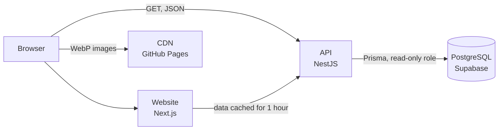

# Gumball API

<p align="right">Versão em português disponível <a href="README.pt.md">aqui</a>.</p>

<table>
  <tr>
    <td width="800px">
      <div align="justify">
        The <b>Gumball API</b> brings together the data of <i>The Amazing World of Gumball</i> and <i>The Wonderfully Weird World of Gumball</i> in one place: the <b>characters, locations, episodes, seasons, songs, games and media</b> that exist within the series. All content was researched and written originally, in English, and every image is served as <b>WebP</b> from a dedicated CDN. The API requires no authentication or access key, offers <i>pagination</i>, <i>filters</i>, <i>sorting</i>, <i>lookups by id or slug</i> and <i>random picks</i> on every resource, and connects the data across resources, such as the episode where each character first appears. The repository also includes the official project website, with a home page, complete documentation in English, Portuguese and Spanish, and panels to test every route directly in the browser.
      </div>
    </td>
    <td>
      <div>
        
      </div>
    </td>
  </tr>
</table>

---

## 🚧 Project Status

[](https://gumball-api-server.vercel.app)
[](#-license)


---

## 📚 Table of Contents

- [Useful Links](#-useful-links)
- [About the Project](#-about-the-project)
- [Key Features](#-key-features)
- [Technologies](#-technologies)
  - [Front-end](#-front-end)
  - [Back-end](#-back-end)
  - [Infrastructure](#-infrastructure)
- [Architecture](#-architecture)
- [Installation and Setup](#-installation-and-setup)
  - [Prerequisites](#prerequisites)
  - [Environment Variables](#-environment-variables)
  - [Installing Dependencies](#-installing-dependencies)
  - [Database](#-database)
  - [Running the Application](#-running-the-application)
- [Deployment](#-deployment)
- [Folder Structure](#-folder-structure)
- [Usage Example](#-usage-example)
- [Tests](#-tests)
- [References](#-references)
- [Author](#-author)
- [Contributing](#-contributing)
- [License](#-license)

---

## 🔗 Useful Links

- **Website and documentation:** [gumball-api.vercel.app](https://gumball-api.vercel.app)
  API overview, complete documentation with interactive tests on every route and a contact page, in English, Portuguese and Spanish.
- **Production API:** [gumball-api-server.vercel.app](https://gumball-api-server.vercel.app)
  The API root lists every available resource and is a good place to start.

---

## 📝 About the Project

The Gumball API was born from the desire to offer **The Amazing World of Gumball** what projects like the [Rick and Morty API](https://rickandmortyapi.com) and [PokéAPI](https://pokeapi.co) offer their universes: a **free, organized and easy-to-use** data source.

It solves a common problem for anyone who wants to build something about the series, such as a quiz app, a character encyclopedia or a study project: the information exists, but it is scattered across pages made for reading, not for use in code. Here, every character, location, episode, season, song, game and media item has a consistent format, standardized images and links to the other resources.

The project is personal and open, designed for:

- **Students and developers** who need a real and fun API to practice consuming REST APIs, pagination and filters.
- **Fans of the series** who want to build apps, bots or websites about the world of Elmore.
- **Portfolio projects** that need rich data, with images and relationships between entities.

The API is **read-only**: the data is manually curated by the maintainer, which ensures consistency and keeps content from other series out.

---

## ✨ Key Features

- **Seven connected resources:** 245 characters, 112 locations, 305 episodes, 8 seasons, 156 songs, 81 games and 16 media items from the series universe.
- **Complete queries:** pagination, field filters, ascending or descending sorting, lookups by id or slug and random picks on every route.
- **Related data:** characters, locations, songs and media point to the episodes they appear in, and locations form a hierarchy.
- **Open access:** no authentication, no API key and CORS enabled for every origin.
- **Predictable responses:** the same pagination, filter and error format on every route, with strict parameter validation.
- **Layered security:** `GET` routes only, rate limiting per IP, security headers and database access through a read-only role protected by RLS.
- **Interactive documentation:** every route has a panel to send real requests and see the response right on the website.
- **Internationalization:** website in English, Brazilian Portuguese and Spanish, with the chosen language saved in the browser.
- **Light and dark themes:** with the preference saved and applied before the page appears.
- **Contact page:** form with server-side validation and email delivery.

---

## 🛠 Technologies

### 💻 Front-end

- **Framework:** Next.js 16 (App Router) with React 19
- **Language:** TypeScript
- **Styling:** Tailwind CSS 4, with color tokens for the light and dark themes
- **Internationalization:** custom typed dictionaries, with routes per language
- **Quality:** ESLint and Prettier

### 🔌 Back-end

- **Runtime:** Node.js 22.18 or later
- **Framework:** NestJS 12 (ESM, Express)
- **Database:** PostgreSQL hosted on Supabase
- **ORM:** Prisma 7 with the `pg` adapter
- **Validation:** `class-validator` for requests and `zod` for environment variables
- **Security:** Helmet, read-only CORS, rate limiting, read-only database role and Row Level Security
- **Logging:** `nestjs-pino`, with structured logs
- **Quality:** Vitest, oxlint and Prettier

### 🌐 Infrastructure

- **Hosting:** Vercel (API as a Vercel Function and website on Next.js)
- **Database:** Supabase (managed PostgreSQL, with connection pooling)
- **Images:** dedicated CDN on GitHub Pages, with WebP files

---

## 🏗 Architecture

The repository is a monorepo with two independent projects, each with its own deployment on Vercel.



**API (`server`)**

- Organized into **one module per resource** (`characters`, `locations`, `episodes`, `seasons`, `songs`, `games` and `media`), all following the same layers: **controller, service, repository and mapper**, with DTOs for requests and responses. Prisma is only used inside repositories.
- Enum values are stored in uppercase in the database and exposed in kebab-case, always through the same shared converter.
- Links between resources are foreign keys exposed as small reference objects, with the path to the full item.
- Security is applied in four layers: only `GET` routes exist, CORS only allows read methods, database roles only receive `SELECT` and every table has RLS with a single read policy.
- On Vercel, the application runs as a single Vercel Function from an ESM bundle generated at build time.

**Website (`client`)**

- Built with the Next.js **App Router**, with every page statically generated for each language and refreshed hourly with API data.
- English lives at the root (`/docs`) and the other languages use a prefix (`/pt-br/docs`, `/es/docs`). A Next.js `proxy` resolves the routes and remembers the chosen language.
- All text lives in **typed dictionaries**: if a translation is missing, the build fails.
- The technical documentation data (fields, types, filters and examples) is defined once and combined with the descriptions of each language.
- The contact form validates the data on the server with a **Server Action** and then sends the message by email.

---

## 🔧 Installation and Setup

### Prerequisites

- **Node.js:** version **22.18** or later
- **npm:** installed with Node.js
- **Supabase project:** with the read-only `gumball_api_reader` role configured, only required to run the API

---

### 🔑 Environment Variables

Each project has a `.env.example` file with every variable. Copy it to `.env` and fill in the values.

#### API (`server`)

| Variable                 | Required    | Description                                                                                         | Example                                   |
| :----------------------- | :---------- | :-------------------------------------------------------------------------------------------------- | :---------------------------------------- |
| `DATABASE_URL`           | Yes         | Connection for the read-only `gumball_api_reader` role through the transaction pooler (port 6543). | `postgresql://gumball_api_reader...:6543` |
| `DATABASE_MIGRATION_URL` | CLI only    | Connection used by the Prisma CLI and the security audit (port 5432). Never set it in production.  | `postgresql://postgres...:5432`           |
| `DATABASE_SSL_CA`        | Recommended | Supabase root certificate (PEM).                                                                    | `-----BEGIN CERTIFICATE-----...`          |
| `DATABASE_POOL_MAX`      | No          | Maximum connections per instance.                                                                   | `10` (use `2` on Vercel)                  |
| `NODE_ENV`               | No          | Runtime environment.                                                                                | `production`                              |
| `PORT`                   | No          | Local server port.                                                                                  | `3000`                                    |
| `LOG_LEVEL`              | No          | Log level.                                                                                          | `info`                                    |
| `CORS_ORIGINS`           | No          | `*` or a comma-separated list of origins.                                                           | `*`                                       |
| `TRUST_PROXY_HOPS`       | No          | Number of proxies in front of the API.                                                              | `1` on Vercel                             |
| `THROTTLE_TTL_MS`        | No          | Rate limit window, in milliseconds.                                                                 | `60000`                                   |
| `THROTTLE_LIMIT`         | No          | Requests allowed per window and per IP.                                                             | `100`                                     |

#### Website (`client`)

All website variables are optional.

| Variable               | Description                                                                                                 | Example                                 |
| :--------------------- | :---------------------------------------------------------------------------------------------------------- | :-------------------------------------- |
| `NEXT_PUBLIC_API_URL`  | Base URL of the API used by the website. Defaults to the production API.                                    | `https://gumball-api-server.vercel.app` |
| `NEXT_PUBLIC_SITE_URL` | Public URL of the website, used for the canonical URL, `hreflang` and sitemap. Use it with a custom domain. | `https://my-domain.com`                 |

---

### 📦 Installing Dependencies

1. **Clone the repository:**

```bash
git clone https://github.com/arturbomtempo-dev/gumball-api.git
cd gumball-api
```

2. **Install the dependencies of each project:**

```bash
cd server
npm install
cd ../client
npm install
```

---

### 💾 Database

The database is PostgreSQL on Supabase. The schema is versioned with Prisma migrations, and every table is created with RLS and the public read policy already in place.

1. **Apply the migrations:**

```bash
cd server
npm run db:migrate:deploy
```

2. **Audit the security rules:**

```bash
npm run db:verify-security
```

The audit checks permissions, policies and RLS, and attempts real writes with every public role. It fails if any write is accepted.

---

### ⚡ Running the Application

Run the API and the website in two separate terminals.

#### Terminal 1: API

```bash
cd server
npm run start:dev
```

The API is available at **http://localhost:3000**.

#### Terminal 2: Website

To use the local API, create the `client/.env.local` file with `NEXT_PUBLIC_API_URL=http://localhost:3000` and run the website on another port:

```bash
cd client
npx next dev -p 3001
```

The website is available at **http://localhost:3001**. Without the variable, the website uses the production API and can be started with `npm run dev` on the default port.

---

## 🚀 Deployment

The API and the website are deployed as **two separate projects on Vercel**, from the same repository.

1. **API:**
   - Create a Vercel project with the **Root Directory** set to `server`. The `server/vercel.json` file already defines the build, the `gru1` region (São Paulo, close to the database) and the rewrite of every route to the function.
   - Set the `DATABASE_URL`, `DATABASE_SSL_CA`, `NODE_ENV=production`, `DATABASE_POOL_MAX=2` and `TRUST_PROXY_HOPS=1` variables.
   - Never set `DATABASE_MIGRATION_URL` on Vercel. Migrations are only applied from the command line.

2. **Website:**
   - Create another Vercel project with the **Root Directory** set to `client`. Next.js is detected automatically.
   - Set `NEXT_PUBLIC_SITE_URL` if you use a custom domain.

3. **Local validation before deploying:**

```bash
cd server
npm run format:check && npm run lint && npm run typecheck && npm test && npm run test:e2e && npm run build:vercel

cd ../client
npm run lint && npx tsc --noEmit && npm run build
```

---

## 📂 Folder Structure

```
.
├── CITATION.cff                   # Citation metadata for the project.
├── LICENSE.md                     # MIT license of the project.
├── README.md                      # Main documentation, in English.
├── README.pt.md                   # Main documentation, in Portuguese.
│
├── server                         # REST API (NestJS)
│   ├── api/index.js               # Vercel Function entry point.
│   ├── prisma
│   │   ├── schema.prisma          # Data model.
│   │   └── migrations             # Migrations with schema, RLS and read policies.
│   ├── scripts
│   │   ├── bundle-serverless.ts   # Generates the ESM bundle used on Vercel.
│   │   └── verify-database-security.ts  # Audits the database security rules.
│   ├── src
│   │   ├── main.ts                # Local server.
│   │   ├── serverless.ts          # Vercel Function handler.
│   │   ├── bootstrap              # App creation, security, CORS, validation and logging.
│   │   ├── common                 # Pagination, sorting, validation, pipes and error filters.
│   │   ├── config                 # Environment variables validated with zod.
│   │   ├── database               # PrismaService.
│   │   └── modules                # One module per resource, plus the root route.
│   ├── test                       # End-to-end tests and fixtures.
│   ├── .env.example               # API environment variables.
│   └── vercel.json                # API deployment configuration.
│
└── client                         # Website and documentation (Next.js)
    ├── app
    │   ├── [lang]                 # Pages per language: home, documentation, contact and 404.
    │   ├── icon.tsx               # Favicon generated from the logo.
    │   ├── opengraph-image.tsx    # Social preview image generated from the logo.
    │   ├── sitemap.ts             # Sitemap with every page in every language.
    │   └── globals.css            # Color tokens for the light and dark themes.
    ├── components                 # One component per folder, in PascalCase.
    ├── hooks                      # Active section and language hooks.
    ├── lib
    │   ├── i18n                   # Language configuration, dictionaries and metadata.
    │   ├── docs.ts                # Technical documentation data for each resource.
    │   ├── api.ts                 # Cached API requests.
    │   └── contact.ts             # Contact form validation.
    ├── public/logo.png            # Project logo.
    ├── proxy.ts                   # Language resolution for routes.
    └── .env.example               # Website environment variables.
```

---

## 🎥 Usage Example

A request to fetch a character by id:

```bash
curl https://gumball-api-server.vercel.app/characters/1
```

**Response (shortened):**

```json
{
  "id": 1,
  "slug": "gumball-watterson",
  "name": "Gumball Watterson",
  "species": "Cat",
  "status": "alive",
  "firstAppearance": {
    "id": 1,
    "slug": "the-dvd",
    "title": "The DVD",
    "code": "S01E01",
    "url": "/episodes/1"
  },
  "image": "https://arturbomtempo-dev.github.io/arturbomtempo-cdn/assets/images/projects/gumball-api/characters/gumball-watterson.webp",
  "url": "/characters/1"
}
```

Filters, sorting and pagination can be combined in the same request:

```bash
curl "https://gumball-api-server.vercel.app/episodes?season=1&sort=-usAirDate&limit=5"
```

---

## 🧪 Tests

### Unit Tests

Cover the API mappers, services and shared utilities.

```bash
cd server
npm test
```

### End-to-End Tests

Start the complete NestJS application with a mocked database and validate routes, filters, parameter validation, security headers and the blocking of write methods.

```bash
cd server
npm run test:e2e
```

_Tools used: Vitest, with Supertest for the end-to-end tests. There are 68 unit tests and 153 end-to-end tests._

---

## 🔗 References

- **Framework (Back-end):** [Official **NestJS** Documentation](https://docs.nestjs.com)
- **ORM:** [Official **Prisma** Documentation](https://www.prisma.io/docs)
- **Database:** [**Supabase** Documentation](https://supabase.com/docs)
- **Framework (Front-end):** [Official **Next.js** Documentation](https://nextjs.org/docs)
- **Styling:** [**Tailwind CSS** Documentation](https://tailwindcss.com/docs)
- **Testing:** [**Vitest** Documentation](https://vitest.dev)
- **Deployment:** [**Vercel** Documentation](https://vercel.com/docs)
- **Commit Convention:** [**Conventional Commits**](https://www.conventionalcommits.org/en/v1.0.0/)

---

## 👥 Author

| Name                 | Photo                                                                                                                 | GitHub                                                                                                                                                                                            | LinkedIn                                                                                                                                                                                                   | Gmail                                                                                                                                                                                    |
| -------------------- | --------------------------------------------------------------------------------------------------------------------- | ------------------------------------------------------------------------------------------------------------------------------------------------------------------------------------------------- | ---------------------------------------------------------------------------------------------------------------------------------------------------------------------------------------------------------- | ---------------------------------------------------------------------------------------------------------------------------------------------------------------------------------------- |
| Artur Bomtempo Colen | <div align="center"></div> | <div align="center"><a href="https://github.com/arturbomtempo-dev"></a></div> | <div align="center"><a href="https://www.linkedin.com/in/artur-bomtempo/"></a></div> | <div align="center"><a href="mailto:arturbcolen@gmail.com"></a></div> |

---

## 🤝 Contributing

The API data is manually curated by the maintainer, so the best way to contribute to the content is to **open an issue** pointing out the wrong or missing information, ideally with a source.

To contribute code:

1. `Fork` the project.
2. Create a branch for your change (`git checkout -b feat/my-change`).
3. Commit your changes following the [Conventional Commits](https://www.conventionalcommits.org/en/v1.0.0/) convention (`git commit -m 'feat: add season filter'`).
4. Run the checks of the project you changed (formatting, lint, typecheck, tests and build).
5. `Push` the branch (`git push origin feat/my-change`).
6. Open a **Pull Request** describing the change.

---

## 📄 License

This project is distributed under the **[MIT License](LICENSE.md)**.
