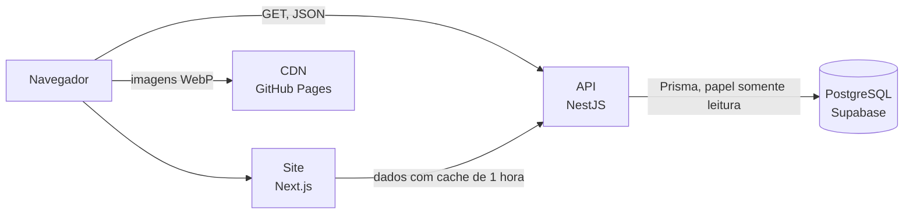

# Gumball API

<p align="right">English version available <a href="README.md">here</a>.</p>

<table>
  <tr>
    <td width="800px">
      <div align="justify">
        A <b>Gumball API</b> reúne em um só lugar os dados do universo de <i>The Amazing World of Gumball</i> e <i>The Wonderfully Weird World of Gumball</i>: <b>personagens, lugares, episódios, temporadas, músicas, jogos e mídias</b> que existem dentro da série. Todo o conteúdo foi pesquisado e escrito de forma original, em inglês, e as imagens são servidas em <b>WebP</b> por uma CDN própria. A API não exige autenticação nem chave de acesso, oferece <i>paginação</i>, <i>filtros</i>, <i>ordenação</i>, <i>busca por id ou slug</i> e <i>seleção aleatória</i> em todos os recursos, e conecta os dados entre si, como o episódio em que cada personagem aparece pela primeira vez. O repositório também traz o site oficial do projeto, com página inicial, documentação completa em inglês, português e espanhol, e painéis para testar cada rota direto no navegador.
      </div>
    </td>
    <td>
      <div>
        
      </div>
    </td>
  </tr>
</table>

---

## 🚧 Status do Projeto

[](https://gumball-api-server.vercel.app)
[](#-licença)


---

## 📚 Índice

- [Links Úteis](#-links-úteis)
- [Sobre o Projeto](#-sobre-o-projeto)
- [Funcionalidades Principais](#-funcionalidades-principais)
- [Tecnologias Utilizadas](#-tecnologias-utilizadas)
  - [Front-end](#-front-end)
  - [Back-end](#-back-end)
  - [Infraestrutura](#-infraestrutura)
- [Arquitetura](#-arquitetura)
- [Instalação e Execução](#-instalação-e-execução)
  - [Pré-requisitos](#pré-requisitos)
  - [Variáveis de Ambiente](#-variáveis-de-ambiente)
  - [Instalação de Dependências](#-instalação-de-dependências)
  - [Banco de Dados](#-banco-de-dados)
  - [Como Executar a Aplicação](#-como-executar-a-aplicação)
- [Deploy](#-deploy)
- [Estrutura de Pastas](#-estrutura-de-pastas)
- [Exemplo de Uso](#-exemplo-de-uso)
- [Testes](#-testes)
- [Documentações Utilizadas](#-documentações-utilizadas)
- [Autor](#-autor)
- [Contribuição](#-contribuição)
- [Licença](#-licença)

---

## 🔗 Links Úteis

- **Site e documentação:** [gumball-api.vercel.app](https://gumball-api.vercel.app)
  Apresentação da API, documentação completa com testes interativos em cada rota e página de contato, em inglês, português e espanhol.
- **API em produção:** [gumball-api-server.vercel.app](https://gumball-api-server.vercel.app)
  A raiz da API lista todos os recursos disponíveis e é um bom ponto de partida.

---

## 📝 Sobre o Projeto

A Gumball API nasceu da vontade de oferecer para a série **O Incrível Mundo de Gumball** o que projetos como a [Rick and Morty API](https://rickandmortyapi.com) e a [PokéAPI](https://pokeapi.co) oferecem para seus universos: uma fonte de dados **gratuita, organizada e fácil de consumir**.

Ela resolve um problema comum de quem quer criar algo sobre a série, como um app de quiz, uma enciclopédia de personagens ou um projeto de estudo: as informações existem, mas estão espalhadas em páginas feitas para leitura, e não para uso em código. Aqui, cada personagem, lugar, episódio, temporada, música, jogo e mídia tem um formato consistente, imagens padronizadas e ligações com os demais recursos.

O projeto é pessoal e aberto, pensado para:

- **Estudantes e desenvolvedores** que precisam de uma API real e divertida para praticar consumo de APIs REST, paginação e filtros.
- **Fãs da série** que querem construir apps, bots ou sites sobre o universo de Elmore.
- **Projetos de portfólio** que precisam de dados ricos, com imagens e relações entre entidades.

A API é **somente leitura**: os dados são curados manualmente pelo mantenedor, o que garante consistência e evita conteúdo de outras séries.

---

## ✨ Funcionalidades Principais

- **Sete recursos conectados:** 245 personagens, 112 lugares, 305 episódios, 8 temporadas, 156 músicas, 81 jogos e 16 mídias do universo da série.
- **Consultas completas:** paginação, filtros por campo, ordenação crescente ou decrescente, busca por id ou slug e seleção aleatória em todas as rotas.
- **Dados relacionados:** personagens, lugares, músicas e mídias apontam para os episódios em que aparecem, e os lugares formam uma hierarquia.
- **Acesso livre:** sem autenticação, sem chave de API e com CORS liberado para qualquer origem.
- **Respostas previsíveis:** o mesmo formato de paginação, filtros e erros em todas as rotas, com validação rigorosa de parâmetros.
- **Segurança em camadas:** apenas rotas `GET`, limite de requisições por IP, cabeçalhos de segurança e acesso ao banco por um papel somente leitura protegido por RLS.
- **Documentação interativa:** cada rota tem um painel para enviar requisições reais e ver a resposta no próprio site.
- **Internacionalização:** site em inglês, português do Brasil e espanhol, com o idioma escolhido salvo no navegador.
- **Tema claro e escuro:** com a preferência salva e aplicada antes da página aparecer.
- **Página de contato:** formulário com validação no servidor e envio da mensagem por e-mail.

---

## 🛠 Tecnologias Utilizadas

### 💻 Front-end

- **Framework:** Next.js 16 (App Router) com React 19
- **Linguagem:** TypeScript
- **Estilização:** Tailwind CSS 4, com tokens de cor para os temas claro e escuro
- **Internacionalização:** dicionários tipados próprios, com rotas por idioma
- **Qualidade:** ESLint e Prettier

### 🔌 Back-end

- **Runtime:** Node.js 22.18 ou superior
- **Framework:** NestJS 12 (ESM, Express)
- **Banco de Dados:** PostgreSQL hospedado no Supabase
- **ORM:** Prisma 7 com o adaptador `pg`
- **Validação:** `class-validator` nas requisições e `zod` nas variáveis de ambiente
- **Segurança:** Helmet, CORS somente leitura, limite de requisições, papel de banco somente leitura e Row Level Security
- **Logs:** `nestjs-pino`, com logs estruturados
- **Qualidade:** Vitest, oxlint e Prettier

### 🌐 Infraestrutura

- **Hospedagem:** Vercel (API como Vercel Function e site em Next.js)
- **Banco de Dados:** Supabase (PostgreSQL gerenciado, com pooler de conexões)
- **Imagens:** CDN própria no GitHub Pages, com arquivos em WebP

---

## 🏗 Arquitetura

O repositório é um monorepo com dois projetos independentes, cada um com seu próprio deploy na Vercel.



**API (`server`)**

- Organizada em **módulos por recurso** (`characters`, `locations`, `episodes`, `seasons`, `songs`, `games` e `media`), todos seguindo as mesmas camadas: **controller, service, repository e mapper**, com DTOs para requisições e respostas. O Prisma só é usado dentro dos repositories.
- Os valores de enum são armazenados em maiúsculas no banco e expostos em kebab-case, sempre pelo mesmo conversor compartilhado.
- As ligações entre recursos são chaves estrangeiras expostas como pequenos objetos de referência, com o caminho para o item completo.
- A segurança é aplicada em quatro camadas: só existem rotas `GET`, o CORS só permite métodos de leitura, os papéis do banco só recebem `SELECT` e todas as tabelas têm RLS com uma única política de leitura.
- Na Vercel, a aplicação roda como uma única Vercel Function a partir de um bundle ESM gerado no build.

**Site (`client`)**

- Construído com o **App Router** do Next.js, com todas as páginas geradas estaticamente para cada idioma e atualizadas a cada hora com os dados da API.
- O inglês fica na raiz (`/docs`) e os demais idiomas usam prefixo (`/pt-br/docs`, `/es/docs`). Um `proxy` do Next.js resolve as rotas e lembra o idioma escolhido.
- Os textos ficam em **dicionários tipados**: se uma tradução estiver faltando, o build falha.
- Os dados técnicos da documentação (campos, tipos, filtros e exemplos) são definidos uma única vez e combinados com as descrições de cada idioma.
- O formulário de contato usa uma **Server Action**, que valida os dados no servidor e envia a mensagem por e-mail.

---

## 🔧 Instalação e Execução

### Pré-requisitos

- **Node.js:** versão **22.18** ou superior
- **npm:** instalado junto com o Node.js
- **Projeto no Supabase:** com o papel somente leitura `gumball_api_reader` configurado, necessário apenas para rodar a API

---

### 🔑 Variáveis de Ambiente

Cada projeto tem um arquivo `.env.example` com todas as variáveis. Copie-o para `.env` e preencha os valores.

#### API (`server`)

| Variável                 | Obrigatória   | Descrição                                                                                              | Exemplo                                   |
| :----------------------- | :------------ | :----------------------------------------------------------------------------------------------------- | :---------------------------------------- |
| `DATABASE_URL`           | Sim           | Conexão do papel somente leitura `gumball_api_reader` pelo pooler de transações (porta 6543).          | `postgresql://gumball_api_reader...:6543` |
| `DATABASE_MIGRATION_URL` | Apenas na CLI | Conexão usada pelo Prisma CLI e pela auditoria de segurança (porta 5432). Nunca configure em produção. | `postgresql://postgres...:5432`           |
| `DATABASE_SSL_CA`        | Recomendada   | Certificado raiz do Supabase (PEM).                                                                    | `-----BEGIN CERTIFICATE-----...`          |
| `DATABASE_POOL_MAX`      | Não           | Máximo de conexões por instância.                                                                      | `10` (use `2` na Vercel)                  |
| `NODE_ENV`               | Não           | Ambiente de execução.                                                                                  | `production`                              |
| `PORT`                   | Não           | Porta do servidor local.                                                                               | `3000`                                    |
| `LOG_LEVEL`              | Não           | Nível dos logs.                                                                                        | `info`                                    |
| `CORS_ORIGINS`           | Não           | `*` ou uma lista de origens separadas por vírgula.                                                     | `*`                                       |
| `TRUST_PROXY_HOPS`       | Não           | Quantidade de proxies na frente da API.                                                                | `1` na Vercel                             |
| `THROTTLE_TTL_MS`        | Não           | Janela do limite de requisições, em milissegundos.                                                     | `60000`                                   |
| `THROTTLE_LIMIT`         | Não           | Requisições permitidas por janela e por IP.                                                            | `100`                                     |

#### Site (`client`)

Todas as variáveis do site são opcionais.

| Variável               | Descrição                                                                                     | Exemplo                                 |
| :--------------------- | :-------------------------------------------------------------------------------------------- | :-------------------------------------- |
| `NEXT_PUBLIC_API_URL`  | URL base da API consumida pelo site. O padrão é a API em produção.                            | `https://gumball-api-server.vercel.app` |
| `NEXT_PUBLIC_SITE_URL` | URL pública do site, usada no canonical, no `hreflang` e no sitemap. Use com domínio próprio. | `https://meu-dominio.com`               |

---

### 📦 Instalação de Dependências

1. **Clone o repositório:**

```bash
git clone https://github.com/arturbomtempo-dev/gumball-api.git
cd gumball-api
```

2. **Instale as dependências de cada projeto:**

```bash
cd server
npm install
cd ../client
npm install
```

---

### 💾 Banco de Dados

O banco de dados é um PostgreSQL no Supabase. O schema é versionado com migrations do Prisma, e cada tabela é criada já com RLS e com a política de leitura pública.

1. **Aplique as migrations:**

```bash
cd server
npm run db:migrate:deploy
```

2. **Audite as regras de segurança:**

```bash
npm run db:verify-security
```

A auditoria confere permissões, políticas e RLS, e tenta escrever de verdade com cada papel público. Ela falha se qualquer escrita for aceita.

---

### ⚡ Como Executar a Aplicação

Execute a API e o site em dois terminais separados.

#### Terminal 1: API

```bash
cd server
npm run start:dev
```

A API fica disponível em **http://localhost:3000**.

#### Terminal 2: Site

Para usar a API local, crie o arquivo `client/.env.local` com `NEXT_PUBLIC_API_URL=http://localhost:3000` e rode o site em outra porta:

```bash
cd client
npx next dev -p 3001
```

O site fica disponível em **http://localhost:3001**. Sem a variável, o site usa a API em produção e pode ser iniciado com `npm run dev` na porta padrão.

---

## 🚀 Deploy

A API e o site são publicados como **dois projetos separados na Vercel**, a partir do mesmo repositório.

1. **API:**
   - Crie um projeto na Vercel com **Root Directory** igual a `server`. O arquivo `server/vercel.json` já define o build, a região `gru1` (São Paulo, próxima ao banco) e o redirecionamento de todas as rotas para a função.
   - Configure as variáveis `DATABASE_URL`, `DATABASE_SSL_CA`, `NODE_ENV=production`, `DATABASE_POOL_MAX=2` e `TRUST_PROXY_HOPS=1`.
   - Nunca configure `DATABASE_MIGRATION_URL` na Vercel. As migrations são aplicadas apenas pela linha de comando.

2. **Site:**
   - Crie outro projeto na Vercel com **Root Directory** igual a `client`. O Next.js é detectado automaticamente.
   - Configure `NEXT_PUBLIC_SITE_URL` caso use um domínio próprio.

3. **Validação local antes do deploy:**

```bash
cd server
npm run format:check && npm run lint && npm run typecheck && npm test && npm run test:e2e && npm run build:vercel

cd ../client
npm run lint && npx tsc --noEmit && npm run build
```

---

## 📂 Estrutura de Pastas

```
.
├── CITATION.cff                   # Metadados de citação do projeto.
├── LICENSE.md                     # Licença MIT do projeto.
├── README.md                      # Documentação principal, em inglês.
├── README.pt.md                   # Documentação principal, em português.
│
├── server                         # API REST (NestJS)
│   ├── api/index.js               # Ponto de entrada da Vercel Function.
│   ├── prisma
│   │   ├── schema.prisma          # Modelo de dados.
│   │   └── migrations             # Migrations com schema, RLS e políticas de leitura.
│   ├── scripts
│   │   ├── bundle-serverless.ts   # Gera o bundle ESM usado na Vercel.
│   │   └── verify-database-security.ts  # Audita as regras de segurança do banco.
│   ├── src
│   │   ├── main.ts                # Servidor local.
│   │   ├── serverless.ts          # Handler da Vercel Function.
│   │   ├── bootstrap              # Criação do app, segurança, CORS, validação e logs.
│   │   ├── common                 # Paginação, ordenação, validações, pipes e filtros de erro.
│   │   ├── config                 # Variáveis de ambiente validadas com zod.
│   │   ├── database               # PrismaService.
│   │   └── modules                # Um módulo por recurso, mais a rota raiz.
│   ├── test                       # Testes end-to-end e fixtures.
│   ├── .env.example               # Variáveis de ambiente da API.
│   └── vercel.json                # Configuração de deploy da API.
│
└── client                         # Site e documentação (Next.js)
    ├── app
    │   ├── [lang]                 # Páginas por idioma: início, documentação, contato e 404.
    │   ├── icon.tsx               # Favicon gerado a partir da logo.
    │   ├── opengraph-image.tsx    # Imagem de compartilhamento gerada a partir da logo.
    │   ├── sitemap.ts             # Sitemap com todas as páginas em todos os idiomas.
    │   └── globals.css            # Tokens de cor dos temas claro e escuro.
    ├── components                 # Um componente por pasta, em PascalCase.
    ├── hooks                      # Hooks de seção ativa e de idioma.
    ├── lib
    │   ├── i18n                   # Configuração de idiomas, dicionários e metadados.
    │   ├── docs.ts                # Dados técnicos da documentação de cada recurso.
    │   ├── api.ts                 # Consultas à API com cache.
    │   └── contact.ts             # Validação do formulário de contato.
    ├── public/logo.png            # Logo do projeto.
    ├── proxy.ts                   # Resolução de idioma nas rotas.
    └── .env.example               # Variáveis de ambiente do site.
```

---

## 🎥 Exemplo de Uso

Uma requisição para buscar um personagem pelo id:

```bash
curl https://gumball-api-server.vercel.app/characters/1
```

**Resposta (resumida):**

```json
{
  "id": 1,
  "slug": "gumball-watterson",
  "name": "Gumball Watterson",
  "species": "Cat",
  "status": "alive",
  "firstAppearance": {
    "id": 1,
    "slug": "the-dvd",
    "title": "The DVD",
    "code": "S01E01",
    "url": "/episodes/1"
  },
  "image": "https://arturbomtempo-dev.github.io/arturbomtempo-cdn/assets/images/projects/gumball-api/characters/gumball-watterson.webp",
  "url": "/characters/1"
}
```

Filtros, ordenação e paginação podem ser combinados na mesma requisição:

```bash
curl "https://gumball-api-server.vercel.app/episodes?season=1&sort=-usAirDate&limit=5"
```

---

## 🧪 Testes

### Testes Unitários

Cobrem mappers, services e utilitários compartilhados da API.

```bash
cd server
npm test
```

### Testes End-to-End

Sobem a aplicação NestJS completa com o banco simulado e validam rotas, filtros, validação de parâmetros, cabeçalhos de segurança e o bloqueio de métodos de escrita.

```bash
cd server
npm run test:e2e
```

_Ferramenta utilizada: Vitest, com Supertest nos testes end-to-end. São 68 testes unitários e 153 testes end-to-end._

---

## 🔗 Documentações Utilizadas

- **Framework (Back-end):** [Documentação Oficial do **NestJS**](https://docs.nestjs.com)
- **ORM:** [Documentação Oficial do **Prisma**](https://www.prisma.io/docs)
- **Banco de Dados:** [Documentação do **Supabase**](https://supabase.com/docs)
- **Framework (Front-end):** [Documentação Oficial do **Next.js**](https://nextjs.org/docs)
- **Estilização:** [Documentação do **Tailwind CSS**](https://tailwindcss.com/docs)
- **Testes:** [Documentação do **Vitest**](https://vitest.dev)
- **Deploy:** [Documentação da **Vercel**](https://vercel.com/docs)
- **Padrão de Commits:** [**Conventional Commits**](https://www.conventionalcommits.org/en/v1.0.0/)

---

## 👥 Autor

| Nome                 | Foto                                                                                                                  | GitHub                                                                                                                                                                                            | LinkedIn                                                                                                                                                                                                   | Gmail                                                                                                                                                                                    |
| -------------------- | --------------------------------------------------------------------------------------------------------------------- | ------------------------------------------------------------------------------------------------------------------------------------------------------------------------------------------------- | ---------------------------------------------------------------------------------------------------------------------------------------------------------------------------------------------------------- | ---------------------------------------------------------------------------------------------------------------------------------------------------------------------------------------- |
| Artur Bomtempo Colen | <div align="center"></div> | <div align="center"><a href="https://github.com/arturbomtempo-dev"></a></div> | <div align="center"><a href="https://www.linkedin.com/in/artur-bomtempo/"></a></div> | <div align="center"><a href="mailto:arturbcolen@gmail.com"></a></div> |

---

## 🤝 Contribuição

Os dados da API são curados manualmente pelo mantenedor, então a melhor forma de contribuir com o conteúdo é **abrir uma issue** apontando a informação errada ou faltante, de preferência com a fonte.

Para contribuir com código:

1. Faça um `fork` do projeto.
2. Crie uma branch para sua alteração (`git checkout -b feat/minha-alteracao`).
3. Faça commit das mudanças seguindo o padrão [Conventional Commits](https://www.conventionalcommits.org/en/v1.0.0/) (`git commit -m 'feat: adiciona filtro por temporada'`).
4. Rode as validações do projeto alterado (formatação, lint, typecheck, testes e build).
5. Faça o `push` para a branch (`git push origin feat/minha-alteracao`).
6. Abra um **Pull Request** descrevendo a mudança.

---

## 📄 Licença

Este projeto é distribuído sob a **[Licença MIT](LICENSE.md)**.
